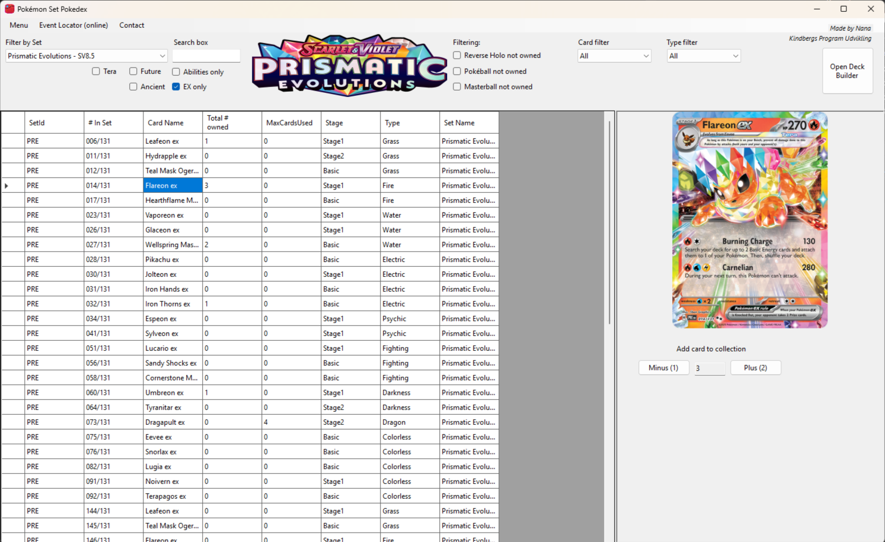

<!-- This is the markdown template for the final project of the Building AI course, 
created by Reaktor Innovations and University of Helsinki. 
Copy the template, paste it to your GitHub README and edit! -->

# Pokémon Card Scanning

Final project for the Building AI course

## Summary

The idea is to use a database of cards from the Pokémon TCG and create a scanner of sorts that can recognise said card and add it into the collection (in another software.) 


## Background

I've made a software already. http://www.kindbergs.dk/pokemon-tcg-pokedex/
that's my motivation for thinking of doing this. 

Problems:
* problem 1 - I'm not sure where to even start or what type of AI to use.
* problem 2 - I'm gonna need help.


## How is it used?

It would be used to easily scan pokémon cards and then add them into the (http://www.kindbergs.dk/pokemon-tcg-pokedex/) software i've made. 
So you have an easy way to add cards to your collection immediately!

Image of the software.
)

Testing resizing images. 



```


## Data sources and AI methods

The data source could be my database of images created with my software for storing what you collect/have. 

## Challenges

This is a challenge. It's pretty much already described....


## Acknowledgments

* Justinbasil.com was my inspiration. That someone could dedicate so much and share it for free just because they love the game, the TCG. May he RIP. 
